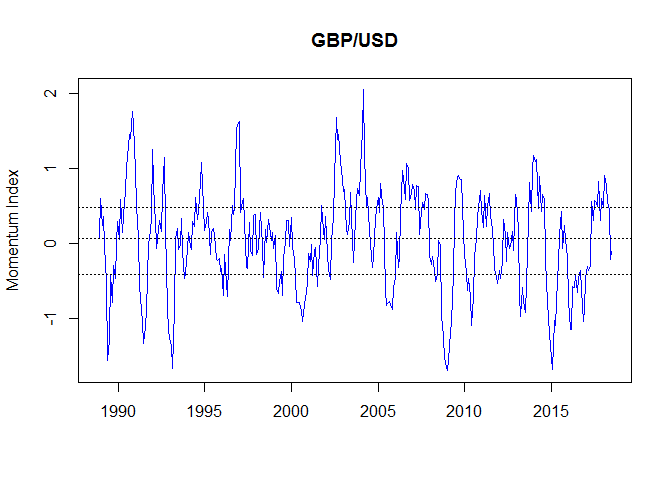
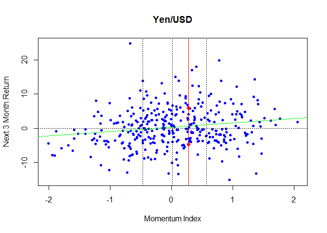

# Momentum Index


2018-06-14

Some charts for historical value of "Momentum Index", defined as 6 month return divided by annual volatility measured on trailing 6 months data.  

We plot the momentum index and add dotted lines for quartiles.  As you would expect, the quartiles are not symmetric around zero for assets with a positive expected return.

We then plot the momentum index against the next three month return.  Quartiles are shown again as dotted lines (now vertical).  The green line is an OLS regression. A vertical red line is the current value of the momentum index with two red dots for a one-sigma confidence interval.   Finally, we show regression statistics. 


```r
require("Rbbg")
require("lubridate")
require("zoo")
conn=blpConnect(verbose=FALSE)
tickers=c("SPX Index","MID Index","SML Index","MXEA Index",
         "MSDLEAFE Index","MXEASC Index","NCLDEAFE Index","MXEF Index","NDLEEGF Index",
         "BCOM Index","CL1 Comdty","XB1 Comdty","C 1 Comdty","HG1 Comdty","XAU Curncy",
         "EURUSD Curncy","GBPUSD Curncy","JPYUSD Curncy")
names(tickers)=c("S&P 500","Mid Cap","Small Cap","EAFE",
                "EAFE Local","EAFE Small","EAFE Small Local","Emg Mkts","Emg Mkts Local",
                "Commodities","WTI","Gasoline","Corn","Copper","Gold",
                "Euro/USD","GBP/USD","Yen/USD")
# tickers=c("AAPL US EQUITY","AMZN US EQUITy","MSFT US EQUITY")
# names(tickers)=c("Apple","Amazon","Microsoft")
flds=c("PX_LAST","VOLATILITY_180D")
for (j in 1:length(tickers)) {
  ticker=tickers[j]
  tname=names(tickers)[j]
  dat=bdh(conn,ticker,flds,Sys.Date()-(366*30),
          option_names="periodicitySelection",option_values="MONTHLY")
  dat2=bdh(conn,ticker,flds,Sys.Date()-183)
  excl=which(apply(is.na(dat2),1,any))
  if(length(excl)>0) dat2=dat2[-excl,]
  pxz=zoo(dat$PX_LAST,as.Date(dat$date))
  volz=zoo(dat$VOLATILITY_180D,as.Date(dat$date))
  lastvol=dat2$VOLATILITY_180D[dim(dat2)[1]]
  volz=c(volz,zoo(lastvol,today()+1))
  rho=diff(log(pxz))
  rhof3=rollapply(rho,FUN=sum,align='left',width=3)
  rhof3=100*(-1+exp(rhof3))
  rhot6=rollapply(rho,FUN=sum,align='right',width=6)
  rhot6=100*(-1+exp(rhot6))
  lastrho=as.numeric(100*(-1+dat2$PX_LAST[dim(dat2)[1]]/dat2$PX_LAST[1]))
  rhot6=c(rhot6,zoo(lastrho,today()+1))
  mom=rhot6/volz 
  plot(mom,col='blue',xlab='',ylab='Momentum Index',main=names(tickers)[j])
  abline(h=quantile(mom,na.rm=TRUE)[c(2,3,4)],lty='dotted')
  rmat=merge(mom,rhof3)
  exc=which(apply(is.na(merge(mom,rhof3)),1,any))
  rmat=rmat[-exc,]
  momentum_index=rmat[,1]
  forward_3mo_return=rmat[,2]
  plot(rmat[,1],rmat[,2],pch=20,col='blue',
       main=names(tickers)[j],xlab='Momentum Index',ylab='Next 3 Month Return')
  abline(v=quantile(mom,na.rm=TRUE)[c(2,3,4)],lty='dotted')
  abline(h=0,lty='dotted')
  lastmom=as.numeric(mom[length(mom)])
  abline(v=lastmom,col='red')
  model=lm(forward_3mo_return~momentum_index)
  ci.calc=c(1,lastmom)%*%confint(model,level=.99)
  new=data.frame(momentum_index=lastmom)
  ci=predict(model,newdata = new,level=.65,interval='prediction')
  ci=ci[1,c(2,3)]
  abline(model,col='green')
  points(c(lastmom,lastmom),ci,col='red',pch=19)
  print(summary(model))
}
```

<!-- --><!-- -->

```
## 
## Call:
## lm(formula = forward_3mo_return ~ momentum_index)
## 
## Residuals:
##      Min       1Q   Median       3Q      Max 
## -29.9234  -3.2028   0.2628   4.2308  25.7572 
## 
## Coefficients:
##                Estimate Std. Error t value Pr(>|t|)    
## (Intercept)      1.0066     0.4463   2.255   0.0247 *  
## momentum_index   2.8502     0.5921   4.814 2.21e-06 ***
## ---
## Signif. codes:  0 '***' 0.001 '**' 0.01 '*' 0.05 '.' 0.1 ' ' 1
## 
## Residual standard error: 6.958 on 351 degrees of freedom
## Multiple R-squared:  0.06192,	Adjusted R-squared:  0.05925 
## F-statistic: 23.17 on 1 and 351 DF,  p-value: 2.207e-06
```

<!-- --><!-- -->

```
## 
## Call:
## lm(formula = forward_3mo_return ~ momentum_index)
## 
## Residuals:
##     Min      1Q  Median      3Q     Max 
## -38.719  -4.862   0.866   4.518  26.779 
## 
## Coefficients:
##                Estimate Std. Error t value Pr(>|t|)    
## (Intercept)      2.1890     0.5757   3.802 0.000172 ***
## momentum_index   1.5587     0.7461   2.089 0.037488 *  
## ---
## Signif. codes:  0 '***' 0.001 '**' 0.01 '*' 0.05 '.' 0.1 ' ' 1
## 
## Residual standard error: 8.303 on 318 degrees of freedom
## Multiple R-squared:  0.01354,	Adjusted R-squared:  0.01044 
## F-statistic: 4.365 on 1 and 318 DF,  p-value: 0.03749
```

<!-- --><!-- -->

```
## 
## Call:
## lm(formula = forward_3mo_return ~ momentum_index)
## 
## Residuals:
##     Min      1Q  Median      3Q     Max 
## -36.767  -4.935   0.753   5.503  27.213 
## 
## Coefficients:
##                Estimate Std. Error t value Pr(>|t|)    
## (Intercept)      2.3312     0.6379   3.655 0.000307 ***
## momentum_index   1.3834     0.8170   1.693 0.091510 .  
## ---
## Signif. codes:  0 '***' 0.001 '**' 0.01 '*' 0.05 '.' 0.1 ' ' 1
## 
## Residual standard error: 9.112 on 282 degrees of freedom
## Multiple R-squared:  0.01006,	Adjusted R-squared:  0.006554 
## F-statistic: 2.867 on 1 and 282 DF,  p-value: 0.09151
```

<!-- --><!-- -->

```
## 
## Call:
## lm(formula = forward_3mo_return ~ momentum_index)
## 
## Residuals:
##     Min      1Q  Median      3Q     Max 
## -33.706  -4.251   0.175   4.954  33.558 
## 
## Coefficients:
##                Estimate Std. Error t value Pr(>|t|)    
## (Intercept)      0.3484     0.4607   0.756     0.45    
## momentum_index   2.5956     0.5759   4.507 8.96e-06 ***
## ---
## Signif. codes:  0 '***' 0.001 '**' 0.01 '*' 0.05 '.' 0.1 ' ' 1
## 
## Residual standard error: 8.197 on 351 degrees of freedom
## Multiple R-squared:  0.05471,	Adjusted R-squared:  0.05202 
## F-statistic: 20.31 on 1 and 351 DF,  p-value: 8.964e-06
```

<!-- --><!-- -->

```
## 
## Call:
## lm(formula = forward_3mo_return ~ momentum_index)
## 
## Residuals:
##      Min       1Q   Median       3Q      Max 
## -27.7480  -4.1093   0.7559   4.5919  22.0345 
## 
## Coefficients:
##                Estimate Std. Error t value Pr(>|t|)    
## (Intercept)    0.007881   0.416778   0.019    0.985    
## momentum_index 2.973863   0.475910   6.249  1.2e-09 ***
## ---
## Signif. codes:  0 '***' 0.001 '**' 0.01 '*' 0.05 '.' 0.1 ' ' 1
## 
## Residual standard error: 7.332 on 351 degrees of freedom
## Multiple R-squared:  0.1001,	Adjusted R-squared:  0.09755 
## F-statistic: 39.05 on 1 and 351 DF,  p-value: 1.198e-09
```

<!-- --><!-- -->

```
## 
## Call:
## lm(formula = forward_3mo_return ~ momentum_index)
## 
## Residuals:
##     Min      1Q  Median      3Q     Max 
## -38.297  -5.139  -0.030   5.763  39.970 
## 
## Coefficients:
##                Estimate Std. Error t value Pr(>|t|)    
## (Intercept)      0.6302     0.5629   1.119    0.264    
## momentum_index   2.6193     0.5154   5.082 6.65e-07 ***
## ---
## Signif. codes:  0 '***' 0.001 '**' 0.01 '*' 0.05 '.' 0.1 ' ' 1
## 
## Residual standard error: 9.216 on 294 degrees of freedom
## Multiple R-squared:  0.08075,	Adjusted R-squared:  0.07763 
## F-statistic: 25.83 on 1 and 294 DF,  p-value: 6.651e-07
```

<!-- --><!-- -->

```
## 
## Call:
## lm(formula = forward_3mo_return ~ momentum_index)
## 
## Residuals:
##     Min      1Q  Median      3Q     Max 
## -32.944  -4.505  -0.239   5.412  29.717 
## 
## Coefficients:
##                Estimate Std. Error t value Pr(>|t|)    
## (Intercept)      0.8559     0.6819   1.255    0.211    
## momentum_index   2.7882     0.5275   5.286 3.29e-07 ***
## ---
## Signif. codes:  0 '***' 0.001 '**' 0.01 '*' 0.05 '.' 0.1 ' ' 1
## 
## Residual standard error: 8.476 on 198 degrees of freedom
## Multiple R-squared:  0.1237,	Adjusted R-squared:  0.1192 
## F-statistic: 27.94 on 1 and 198 DF,  p-value: 3.29e-07
```

<!-- --><!-- -->

```
## 
## Call:
## lm(formula = forward_3mo_return ~ momentum_index)
## 
## Residuals:
##     Min      1Q  Median      3Q     Max 
## -44.806  -8.164   1.076   7.768  54.617 
## 
## Coefficients:
##                Estimate Std. Error t value Pr(>|t|)    
## (Intercept)      1.5677     0.7292   2.150   0.0322 *  
## momentum_index   2.4153     0.5972   4.044 6.46e-05 ***
## ---
## Signif. codes:  0 '***' 0.001 '**' 0.01 '*' 0.05 '.' 0.1 ' ' 1
## 
## Residual standard error: 12.65 on 351 degrees of freedom
## Multiple R-squared:  0.04452,	Adjusted R-squared:  0.0418 
## F-statistic: 16.36 on 1 and 351 DF,  p-value: 6.455e-05
```

<!-- --><!-- -->

```
## 
## Call:
## lm(formula = forward_3mo_return ~ momentum_index)
## 
## Residuals:
##     Min      1Q  Median      3Q     Max 
## -35.359  -5.297   0.624   5.326  38.566 
## 
## Coefficients:
##                Estimate Std. Error t value Pr(>|t|)    
## (Intercept)      1.9093     0.7897   2.418 0.016530 *  
## momentum_index   2.2846     0.6825   3.347 0.000976 ***
## ---
## Signif. codes:  0 '***' 0.001 '**' 0.01 '*' 0.05 '.' 0.1 ' ' 1
## 
## Residual standard error: 9.484 on 198 degrees of freedom
## Multiple R-squared:  0.05356,	Adjusted R-squared:  0.04878 
## F-statistic: 11.21 on 1 and 198 DF,  p-value: 0.0009762
```

<!-- --><!-- -->

```
## 
## Call:
## lm(formula = forward_3mo_return ~ momentum_index)
## 
## Residuals:
##     Min      1Q  Median      3Q     Max 
## -33.665  -4.317   0.401   3.793  21.756 
## 
## Coefficients:
##                Estimate Std. Error t value Pr(>|t|)    
## (Intercept)     0.03707    0.39357   0.094    0.925    
## momentum_index  3.85170    0.50998   7.553 4.56e-13 ***
## ---
## Signif. codes:  0 '***' 0.001 '**' 0.01 '*' 0.05 '.' 0.1 ' ' 1
## 
## Residual standard error: 7.023 on 318 degrees of freedom
## Multiple R-squared:  0.1521,	Adjusted R-squared:  0.1494 
## F-statistic: 57.04 on 1 and 318 DF,  p-value: 4.562e-13
```

<!-- --><!-- -->

```
## 
## Call:
## lm(formula = forward_3mo_return ~ momentum_index)
## 
## Residuals:
##     Min      1Q  Median      3Q     Max 
## -55.289 -10.338  -0.429   9.544 129.925 
## 
## Coefficients:
##                Estimate Std. Error t value Pr(>|t|)  
## (Intercept)      2.2890     0.9832   2.328   0.0205 *
## momentum_index   3.4974     1.5709   2.226   0.0266 *
## ---
## Signif. codes:  0 '***' 0.001 '**' 0.01 '*' 0.05 '.' 0.1 ' ' 1
## 
## Residual standard error: 17.93 on 351 degrees of freedom
## Multiple R-squared:  0.01392,	Adjusted R-squared:  0.01112 
## F-statistic: 4.957 on 1 and 351 DF,  p-value: 0.02663
```

<!-- --><!-- -->

```
## 
## Call:
## lm(formula = forward_3mo_return ~ momentum_index)
## 
## Residuals:
##     Min      1Q  Median      3Q     Max 
## -64.206 -12.493   1.248   9.947  60.393 
## 
## Coefficients:
##                Estimate Std. Error t value Pr(>|t|)
## (Intercept)      2.2298     1.7796   1.253    0.212
## momentum_index  -0.4946     2.4556  -0.201    0.841
## 
## Residual standard error: 20.92 on 141 degrees of freedom
## Multiple R-squared:  0.0002876,	Adjusted R-squared:  -0.006803 
## F-statistic: 0.04057 on 1 and 141 DF,  p-value: 0.8407
```

<!-- --><!-- -->

```
## 
## Call:
## lm(formula = forward_3mo_return ~ momentum_index)
## 
## Residuals:
##     Min      1Q  Median      3Q     Max 
## -43.012  -7.515   0.275   7.654  60.256 
## 
## Coefficients:
##                Estimate Std. Error t value Pr(>|t|)    
## (Intercept)      0.8186     0.7578   1.080  0.28076    
## momentum_index   3.6730     0.9581   3.834  0.00015 ***
## ---
## Signif. codes:  0 '***' 0.001 '**' 0.01 '*' 0.05 '.' 0.1 ' ' 1
## 
## Residual standard error: 14.03 on 351 degrees of freedom
## Multiple R-squared:  0.04019,	Adjusted R-squared:  0.03745 
## F-statistic:  14.7 on 1 and 351 DF,  p-value: 0.0001497
```

<!-- --><!-- -->

```
## 
## Call:
## lm(formula = forward_3mo_return ~ momentum_index)
## 
## Residuals:
##     Min      1Q  Median      3Q     Max 
## -48.735  -8.087  -0.916   7.680  54.855 
## 
## Coefficients:
##                Estimate Std. Error t value Pr(>|t|)    
## (Intercept)      0.9627     0.7063   1.363    0.174    
## momentum_index   6.3970     0.9580   6.677 9.81e-11 ***
## ---
## Signif. codes:  0 '***' 0.001 '**' 0.01 '*' 0.05 '.' 0.1 ' ' 1
## 
## Residual standard error: 12.93 on 343 degrees of freedom
## Multiple R-squared:  0.115,	Adjusted R-squared:  0.1125 
## F-statistic: 44.59 on 1 and 343 DF,  p-value: 9.812e-11
```

<!-- --><!-- -->

```
## 
## Call:
## lm(formula = forward_3mo_return ~ momentum_index)
## 
## Residuals:
##      Min       1Q   Median       3Q      Max 
## -21.3230  -4.7493  -0.7815   3.5337  27.9605 
## 
## Coefficients:
##                Estimate Std. Error t value Pr(>|t|)    
## (Intercept)      0.8931     0.3710   2.407   0.0166 *  
## momentum_index   2.9074     0.5550   5.239  2.8e-07 ***
## ---
## Signif. codes:  0 '***' 0.001 '**' 0.01 '*' 0.05 '.' 0.1 ' ' 1
## 
## Residual standard error: 6.866 on 351 degrees of freedom
## Multiple R-squared:  0.07252,	Adjusted R-squared:  0.06987 
## F-statistic: 27.44 on 1 and 351 DF,  p-value: 2.796e-07
```

<!-- --><!-- -->

```
## 
## Call:
## lm(formula = forward_3mo_return ~ momentum_index)
## 
## Residuals:
##     Min      1Q  Median      3Q     Max 
## -17.916  -3.298   0.170   3.184  13.690 
## 
## Coefficients:
##                Estimate Std. Error t value Pr(>|t|)    
## (Intercept)     0.05332    0.27076   0.197    0.844    
## momentum_index  1.66606    0.34996   4.761 2.82e-06 ***
## ---
## Signif. codes:  0 '***' 0.001 '**' 0.01 '*' 0.05 '.' 0.1 ' ' 1
## 
## Residual standard error: 5.072 on 351 degrees of freedom
## Multiple R-squared:  0.06066,	Adjusted R-squared:  0.05798 
## F-statistic: 22.66 on 1 and 351 DF,  p-value: 2.825e-06
```

<!-- --><!-- -->

```
## 
## Call:
## lm(formula = forward_3mo_return ~ momentum_index)
## 
## Residuals:
##     Min      1Q  Median      3Q     Max 
## -23.832  -2.453   0.141   2.288  15.801 
## 
## Coefficients:
##                Estimate Std. Error t value Pr(>|t|)    
## (Intercept)     -0.1812     0.2511  -0.722    0.471    
## momentum_index   1.7040     0.3683   4.627 5.22e-06 ***
## ---
## Signif. codes:  0 '***' 0.001 '**' 0.01 '*' 0.05 '.' 0.1 ' ' 1
## 
## Residual standard error: 4.711 on 351 degrees of freedom
## Multiple R-squared:  0.05749,	Adjusted R-squared:  0.05481 
## F-statistic: 21.41 on 1 and 351 DF,  p-value: 5.223e-06
```

<!-- --><!-- -->

```
## 
## Call:
## lm(formula = forward_3mo_return ~ momentum_index)
## 
## Residuals:
##      Min       1Q   Median       3Q      Max 
## -16.5867  -3.6479  -0.3941   3.0788  25.3389 
## 
## Coefficients:
##                Estimate Std. Error t value Pr(>|t|)   
## (Intercept)      0.2433     0.3009   0.808  0.41942   
## momentum_index   1.2720     0.3967   3.206  0.00147 **
## ---
## Signif. codes:  0 '***' 0.001 '**' 0.01 '*' 0.05 '.' 0.1 ' ' 1
## 
## Residual standard error: 5.65 on 351 degrees of freedom
## Multiple R-squared:  0.02845,	Adjusted R-squared:  0.02568 
## F-statistic: 10.28 on 1 and 351 DF,  p-value: 0.001469
```

```r
x=blpDisconnect(conn)
```
