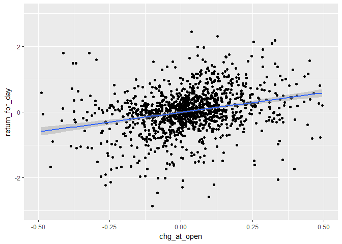

# Open Price Analysis
Karl Polen  


```r
require(ggplot2)
require(Rbbg)
require(lubridate)
conn=blpConnect(verbose=FALSE)
start.date=today()-years(5)
end.date=today()-1
bbgdat=bdh(conn,"SPXT INDEX",c("PX_LAST","PX_OPEN"),start_date=start.date,end_date=end.date)
x=blpDisconnect(conn)
bbgdat$chg_at_open=c(NA,100*(-1+bbgdat$PX_OPEN[-1]/bbgdat$PX_LAST[-nrow(bbgdat)]))
bbgdat$return_for_day=100*(-1+bbgdat$PX_LAST/bbgdat$PX_OPEN)
bbgdat=bbgdat[-1,]
ggplot(bbgdat,aes(x=chg_at_open,y=return_for_day))+geom_point()+
  xlim(c(-.5,.5))+ylim(c(-3,3))+geom_smooth(method='lm')
```

<!-- -->

```r
lm.results=lm(bbgdat$return_for_day~bbgdat$chg_at_open)
summary(lm.results)
```

```
## 
## Call:
## lm(formula = bbgdat$return_for_day ~ bbgdat$chg_at_open)
## 
## Residuals:
##     Min      1Q  Median      3Q     Max 
## -4.0012 -0.3066  0.0284  0.3367  4.2973 
## 
## Coefficients:
##                     Estimate Std. Error t value Pr(>|t|)    
## (Intercept)        -0.004271   0.019765  -0.216    0.829    
## bbgdat$chg_at_open  0.953884   0.103190   9.244   <2e-16 ***
## ---
## Signif. codes:  0 '***' 0.001 '**' 0.01 '*' 0.05 '.' 0.1 ' ' 1
## 
## Residual standard error: 0.6927 on 1256 degrees of freedom
## Multiple R-squared:  0.0637,	Adjusted R-squared:  0.06295 
## F-statistic: 85.45 on 1 and 1256 DF,  p-value: < 2.2e-16
```
