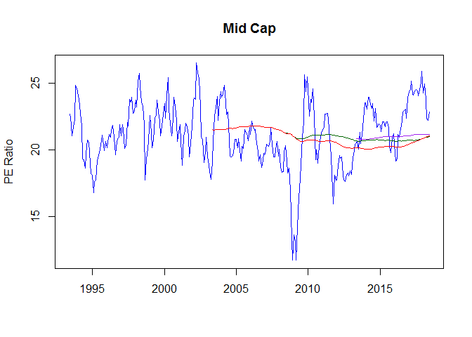
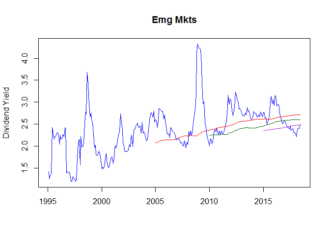

# PEs and P/B

2018-06-14

Following are some charts for each of the SAA categories for our equity assets.  I present PE Ratio, Price to Book ratio and Divident Yield.  On each chart I plot long term averages for these statistics -- red is 10 year moving average, green is 15 year moving average and purple is 20 year moving average.

<!-- --><!-- --><!-- --><!-- --><!-- --><!-- --><!-- --><!-- --><!-- --><!-- --><!-- --><!-- --><!-- --><!-- --><!-- --><!-- --><!-- --><!-- -->

Next I present a series of charts showing the relative value of measurements compared to SPX Index.  The horizontal dotted line is the mean for the statistic.

<!-- --><!-- --><!-- --><!-- --><!-- --><!-- --><!-- --><!-- --><!-- --><!-- --><!-- --><!-- --><!-- --><!-- --><!-- -->
