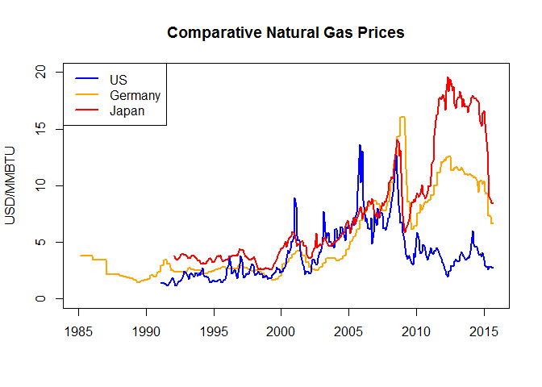
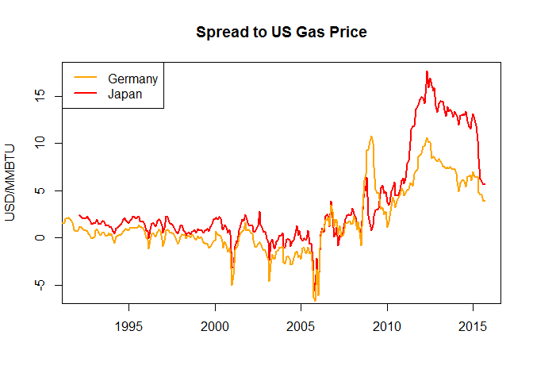

# Global Natural Gas Prices

A study on global natural gas from 2015.

Following are two charts showing comparative global natural gas prices.

<!-- --><!-- -->

Asia is the primary market for US LNG export.  As you can see, spreads have dropped below $7 which some people site as the breakeven for viable Asian export projects.  This may put a damper on future LNG projects, although importers also need to consider supply diversification.  One [commenter](http://fuelfix.com/blog/2015/08/27/10-challenges-faced-by-the-global-lng-market/) noted:

*"There is, however, a strong argument to be made for US LNG exports, regardless of the current price predicament, and this lies with diversification. For both Asian and European markets, long-term agreements for US exports provide a hedge against potential geopolitical tension. After all, Qatar - the largest LNG exporter in the world - exports 10 Bcf/d through the Strait of Hormuz, the most strategic strait in the world."* 

